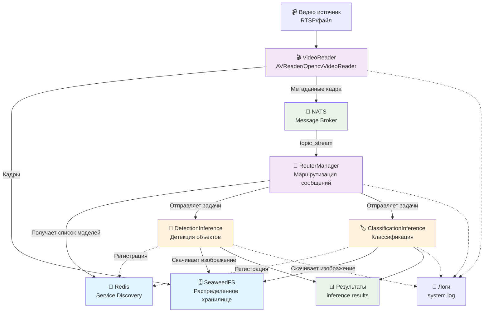

# Архитектура системы обработки видео

## Описание компонентов

### 1. **VideoReader** (Чтение видео)
- **AVReader**: Использует библиотеку `av` для чтения RTSP/видеофайлов
- **OpencvVideoReader**: Использует OpenCV для чтения видео
- Извлекает кадры с настраиваемым пропуском
- Кодирует кадры в JPEG и загружает в SeaweedFS
- Отправляет метаданные кадров в NATS

### 2. **SeaweedFS** (Хранилище)
- Распределенная файловая система
- Хранит кадры видео с TTL
- Компоненты: Master, Volume, Filer
- Предоставляет URL для доступа к кадрам

### 3. **NATS** (Message Broker)
- Асинхронная передача сообщений
- Топики:
  - `topic_stream`: Метаданные новых кадров
  - `{model_name}`: Задачи для конкретных моделей
  - `inference.results`: Результаты обработки

### 4. **Redis** (Service Discovery)
- Хранит список активных моделей в ключе `routing_to_models`
- TTL для автоматического удаления неактивных сервисов
- Используется RouterManager для маршрутизации

### 5. **RouterManager** (Маршрутизация)
- Получает метаданные кадров из NATS
- Динамически отслеживает доступные модели через Redis
- Распределяет задачи между активными моделями
- Реализует паттерн Publisher-Subscriber

### 6. **Модели инференса**
- **DetectionInference**: Детекция объектов (YOLO-подобная)
- **ClassificationInference**: Классификация изображений
- Автоматическая регистрация в Redis
- Скачивание изображений из SeaweedFS
- Пайплайн: preprocess → inference → postprocess

## Поток данных

1. **Захват кадров**: VideoReader читает видео и извлекает кадры
2. **Сохранение**: Кадры сохраняются в SeaweedFS с уникальными ID
3. **Уведомление**: Метаданные кадра отправляются в NATS топик
4. **Маршрутизация**: RouterManager получает сообщение и распределяет между моделями
5. **Обработка**: Модели скачивают изображения и выполняют инференс
6. **Результаты**: Результаты публикуются в топик `inference.results`

## Масштабируемость

- **Горизонтальное масштабирование**: Можно запускать несколько экземпляров каждой модели
- **Автоматическое обнаружение**: Новые модели автоматически регистрируются
- **Отказоустойчивость**: TTL в Redis обеспечивает удаление мертвых сервисов
- **Асинхронность**: Все компоненты работают асинхронно

## Конфигурация

Система настраивается через переменные окружения:
- `video_source`: Источник видео
- `nats_host`: NATS сервер
- `redis_host/redis_port`: Redis подключение
- `master_url/volume_url`: SeaweedFS endpoints
- `topic_stream`: Топик для кадров